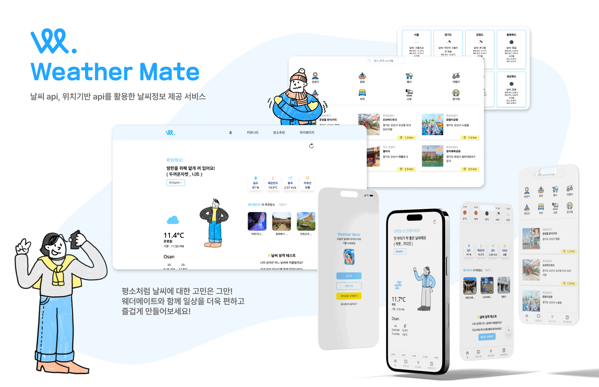
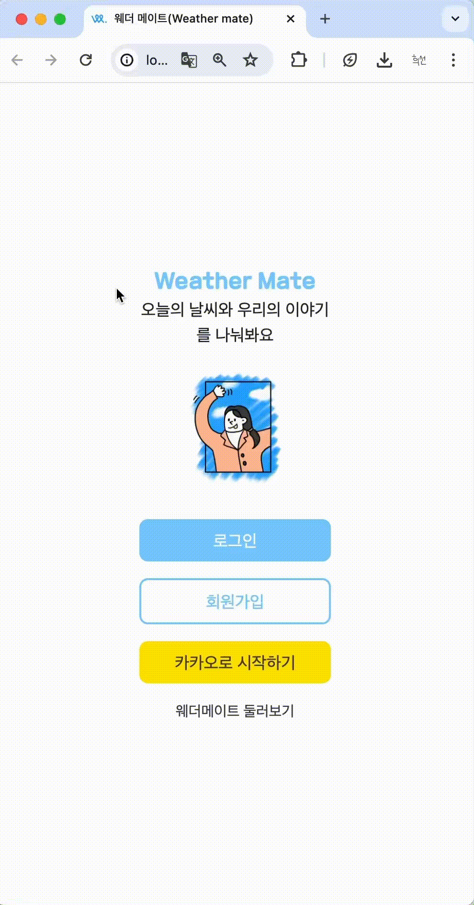
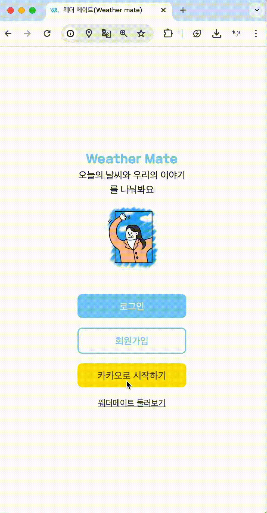
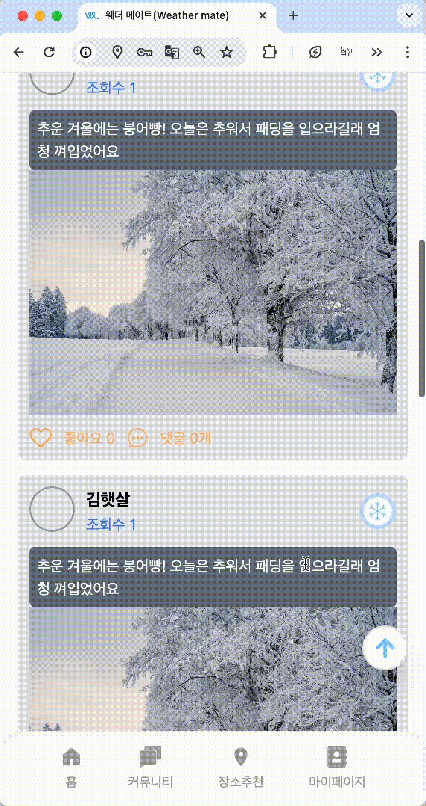

<h1 align="center">웨더메이트(WeatherMate)🌤️</h1>
</br>

<p align="center">


</br>

## 1. 서비스 소개

많은 사람들이 외출하기 전 일기 예보를 통해 오늘의 날씨를 확인해 우산을 가져가야 할지, 겉옷을 챙겨야할지 등을 결정하거나 오늘의 하루를 계획하는데 도움을 받고 있습니다. 일상에서 날씨 확인은 중요한 일과라고 할 수 있습니다.

<strong>웨더메이트는</strong>

여러분의 날씨 고민을 함께 해결해드립니다! 우리 서비스는 현재 위치와 시간에 해당하는 날씨와 하루의 날씨를 알려주고 그 날씨에 알맞은 옷차림을 추천해드립니다. 또한 여러분의 근처에 있는 다양한 장소들을 추천해드리고 있습니다. 가볍게 외출을 하고싶거나 친구와 약속을 잡을 때 웨더메이트의 장소 추천 서비스를 통해 날씨에 알맞은 장소를 선택해보세요! 웨더메이트에서 여러분의 일상을 공유하고 다른 사람들과 소통도 즐겨보세요.

평소처럼 날씨에 대한 고민은 그만! 웨더메이트와 함께 일상을 더욱 편하고 즐겁게 만들어보세요!
</br>

### 🌤️ 웨더메이트 배포 링크 및 테스트 계정

👉🏻 [웨더 메이트 ](https://weathermates.netlify.app/, '바로가기')

```수정하기
ID: hello@weathermate.com
PW: 11111111
```

</br>

## 2.팀 소개

안녕하세요, 저희는 Look at this 입니다. 🖐️

<table>
  <tbody>
    <tr>
      <td align="center"><a href="https://github.com/woojoung1217"><br /><sub><b>FE 전희선(팀장)</b></sub></a><br /></td>
      <td align="center"><a href="https://github.com/g0meee"><<br /><sub><b>FE 김경미</b></sub></a><br /></td>
      <td align="center"><a href="https://github.com/woojoung1217"><br /><sub><b>FE 윤우중</b></sub></a><br /></td>
      <td align="center"><a href="https://github.com/holajjm"><br /><sub><b>FE 정종민</b></sub></a><br /></td>
     <tr/>
  </tbody>
</table>

</br>
</br>

팀원 별 세부 역할을 봐주세요! </br>
👉🏻 [요구사항 명세 ](https://docs.google.com/spreadsheets/d/1aOmXCmIL_nGyIvDJu-r7xOQqAehTsCyaAJN020VKznY/edit#gid=363195429, '바로가기')

## 3. 개발 기간 (24.03.29 ~ 24.04.25)

| 주차        |                                                                                                           |
| ----------- | --------------------------------------------------------------------------------------------------------- |
| 1주차 </br> | - 프로젝트 기획 , 주제 선정 , 기술 스택 및 협업 툴 선정 ,</br> - Figma UI 디자인 작업, 기능 요구사항 명세 |
| 2주차 </br> | - 역할 분배 </br> - 기획 구체화 페이지 별 UI구현 <br/> - 전담 페이지 API 구현                             |
| 3주차 </br> | - 기능 테스트, 케이스 작성 및 보완, <br/> - 실유저 테스트, 버그수정 배포                                  |

</br>

## 4. 협업 방식 & 선정이유

  <div>
    
    
    
    
  </div>

- Github를 통해 프로젝트 코드 공유 및 버전 관리
- 프로젝트를 효과적으로 관리하기 위해 Git Flow 전략을 선택했습니다. 이전의 main, develop, feature 브랜치를 사용하여 기능 개발을 격리하고, 코드 품질을 보장하며, 충돌을 최소화하여 개발과정을 원활하게 진행 했습니다.
- UI/UX 디자인을 위해 피그마를 선택했습니다.
- 디스코드를 활용해 실시간으로 상황 공유 | 데일리 스크럼을 통해 협업을 진행 했습니다.
- 구글 스프레드시트를 이용해 프로젝트 진행 사항 및 공유 사항을 기록하고 관리하기 위해 구글 스프레드시트를 선택했습니다. 스프레드시트를 통해 실시간으로 데이터를 공유하고 프로젝트의 전반적인 진행 상황을 투명하게 관리할 수 있었습니다.

  </br>

### 5. 🔨 기술 스택

<div>
    
  

  
</br> 
    
  
  
  
  
  


</div>

<br/>

## 6. 프로젝트 폴더 구조

```
📦WeatherMate
 ┣ 📂public
 ┣ 📂src
 ┃ ┣ 📂assets
 ┃ ┃ ┣ 📂mbti
 ┃ ┃ ┃ ┣ 📂mbtiimg
 ┃ ┃ ┃ ┃
 ┃ ┃ ┃ ┗ 📜MbtiResultData.js
 ┃ ┃ ┣ 📜MbtiQuestionData.js
 ┃ ┃ ┣ 📜WeatherData.js
 ┃ ┃ ┗ 📜react.svg
 ┃ ┣ 📂components
 ┃ ┃ ┣ 📂layout
 ┃ ┃ ┃ ┣ 📜Button.jsx
 ┃ ┃ ┃ ┣ 📜DetailPageHeader.jsx
 ┃ ┃ ┃ ┣ 📜Footer.jsx
 ┃ ┃ ┃ ┣ 📜Landing.jsx
 ┃ ┃ ┃ ┣ 📜Loading.jsx
 ┃ ┃ ┃ ┣ 📜Loading2.jsx
 ┃ ┃ ┃ ┣ 📜NavigationBarTop.jsx
 ┃ ┃ ┃ ┣ 📜NavigationBarbottom.jsx
 ┃ ┃ ┃ ┣ 📜Search.jsx
 ┃ ┃ ┃ ┣ 📜Submit.jsx
 ┃ ┃ ┃ ┣ 📜ToTheTopButton.jsx
 ┃ ┃ ┃ ┗ 📜index.jsx
 ┃ ┃ ┗ 📜KakaoShareButton.jsx
 ┃ ┣ 📂hooks
 ┃ ┃ ┣ 📜useCurrentLocation.js
 ┃ ┃ ┣ 📜useCustomAxios.mjs
 ┃ ┃ ┗ 📜useDebounce.js
 ┃ ┣ 📂pages
 ┃ ┃ ┣ 📂Mbti
 ┃ ┃ ┃ ┣ 📜MbtiHome.jsx
 ┃ ┃ ┃ ┣ 📜MbtiQuestion.jsx
 ┃ ┃ ┃ ┣ 📜MbtiResult.jsx
 ┃ ┃ ┃ ┗ 📜MbtiTest.jsx
 ┃ ┃ ┣ 📂community
 ┃ ┃ ┃ ┣ 📜CommunityDetail.jsx
 ┃ ┃ ┃ ┣ 📜CommunityHeader.jsx
 ┃ ┃ ┃ ┣ 📜CommunityItem.jsx
 ┃ ┃ ┃ ┣ 📜CommunityMain.jsx
 ┃ ┃ ┃ ┣ 📜CommunityNew.jsx
 ┃ ┃ ┃ ┣ 📜CommunityPopularItem.jsx
 ┃ ┃ ┃ ┣ 📜ReplyEdit.jsx
 ┃ ┃ ┃ ┣ 📜ReplyItem.jsx
 ┃ ┃ ┃ ┣ 📜ReplyList.jsx
 ┃ ┃ ┃ ┗ 📜ReplyNew.jsx
 ┃ ┃ ┣ 📂location
 ┃ ┃ ┃ ┣ 📜Location.jsx
 ┃ ┃ ┃ ┣ 📜LocationBookmark.jsx
 ┃ ┃ ┃ ┣ 📜LocationDetailPage.jsx
 ┃ ┃ ┃ ┣ 📜LocationKeyword.jsx
 ┃ ┃ ┃ ┣ 📜LocationMainPage.jsx
 ┃ ┃ ┃ ┣ 📜LocationMap.jsx
 ┃ ┃ ┃ ┣ 📜SearchLocation.jsx
 ┃ ┃ ┃ ┗ 📜noResultMsg.jsx
 ┃ ┃ ┣ 📂main
 ┃ ┃ ┃ ┣ 📜AllCitiesWeather.jsx
 ┃ ┃ ┃ ┣ 📜MainPage.jsx
 ┃ ┃ ┃ ┣ 📜MyLocationWeather.jsx
 ┃ ┃ ┃ ┣ 📜PreviewMbti.jsx
 ┃ ┃ ┃ ┣ 📜RecommendationPreview.jsx
 ┃ ┃ ┃ ┣ 📜TodaysComent.jsx
 ┃ ┃ ┃ ┣ 📜WeatherByTimeZone.jsx
 ┃ ┃ ┃ ┗ 📜weatherDetail.jsx
 ┃ ┃ ┣ 📂user
 ┃ ┃ ┃ ┣ 📜Edit.jsx
 ┃ ┃ ┃ ┣ 📜EnvCheck.jsx
 ┃ ┃ ┃ ┣ 📜Login.jsx
 ┃ ┃ ┃ ┣ 📜MainLogin.jsx
 ┃ ┃ ┃ ┣ 📜Oauth.jsx
 ┃ ┃ ┃ ┣ 📜Setting.jsx
 ┃ ┃ ┃ ┣ 📜SignUp.jsx
 ┃ ┃ ┃ ┣ 📜UserBoard.jsx
 ┃ ┃ ┃ ┣ 📜UserEdit.jsx
 ┃ ┃ ┃ ┣ 📜UserPage.jsx
 ┃ ┃ ┃ ┗ 📜UserPost.jsx
 ┃ ┃ ┗ 📜ErrorPage.jsx
 ┃ ┣ 📂recoil
 ┃ ┃ ┗ 📜atom.mjs
 ┃ ┣ 📜App.css
 ┃ ┣ 📜App.jsx
 ┃ ┣ 📜index.css
 ┃ ┣ 📜main.jsx
 ┃ ┗ 📜routes.jsx
 ┣ 📜.DS_Store
 ┣ 📜README.md
 ┣ 📜jsconfig.json
 ┣ 📜netlify.toml
 ┣ 📜package-lock.json
 ┣ 📜package.json
 ┣ 📜postcss.config.js
 ┣ 📜tailwind.config.js
 ┗ 📜vite.config.js
```

## **7. 세부 역할 분담**

### ❤️ 전희선

> **🎨 역할**

- UI 디자인 전체
- 디자인 시스템 제작
- 발표 시각 자료 제작
- 깃허브 관리
- 프로젝트 배포
- 리드미 작성

<br/>

> **UI 구현**

- 로그인 페이지
- 회원가입 페이지
- 사용자 정보 수정 페이지
- 사용자 마이페이지
- 에러 페이지 404
- 랜딩 페이지
- 메인화면 로그인 애니메이션
- 사용자 마이페이지 북마크
- 내 활동 글 보기
- 카카오 로그인

<br/>

> **기능 구현**

- 404 페이지

- 존재하지 않는 페이지 접근 시, 해당 페이지를 보여주고 useNavigate 훅을 사용하여 이전 페이지로 이동

- 상태관리
  유저의 정보를 Recoil에 담아 사용자의 로그인 여부를 파악하고 그에 따른 콘텐츠를 렌더링

- 로그아웃 기능 구현
  로그인 정보를 localStorage에서 제거하고, useNavigate로 사용자를 루트 페이지로 이동

- 데이터 수집

  - useQuery를 통해 데이터를 가져오는데 사용하고 가져온 데이터의 상태를 관리하고 캐싱기능을 제공

- 데이터 수정
  useCustomAxios Hook는 Axios를 사용하여 HTTP요청을 만들고 customAxios.patch() 메서드를 사용하여 PATH 요청. 이때 수정된 사용자 정보가 업데이트 된 데이터로 전송

- 응답처리

  - HTTP 요청의 응답은 response 변수에 저장
  - 응답 상태 코드를 확인하고, 성공하면 사용자 정보를 업데이트

- 사용자 정보 업데이트

  - 성공적인 응답을 받은 경우, setUser 함수를 사용하여 Recoil 상태를 업데이트합니다.
    이를 통해 화면이 다시 렌더링되고 변경된 정보가 반영

- 입력 값 초기화

  - 수정된 부분을 초기화하기 위해 변경된 부분의 상태 변수들을 초기화

- 폼관리

  - useForm hook을 사용하여 폼을 관리하고 register 함수로 각 입력 필드를 등록

- 카카오 로그인
  - React와 관련된 기술 스택을 사용하여 사용자 인터페이스를 구성하고, - Axios를 사용하여 외부 API와 통신하며, Recoil을 사용하여 전역 상태 관리.
  - React Router를 사용하여 페이지 간의 라우팅을 처리하고, useEffect 훅을 사용하여 컴포넌트의 부수 효과를 관리.
    <br/>

### 💙 김경미

> **🎨 역할**

- 날씨 성격 테스트 페이지 디자인
- 리드미 작성

<br/>

> **UI 구현**

- 날씨 성격 테스트 시작 페이지
- 날씨 성격 테스트 질문 페이지
- 날씨 성격 테스트 결과 페이지
- 장소 추천 상세 페이지
- DetailPageHeader
- NavigationBar(상/하단)
- Footer

<br/>

> **기능 구현**

  </br>
    
- 날씨 성격 테스트 시작 페이지
    - 시작하기 버튼 누르면 질문 페이지로 넘어가게 구현

- 날씨 성격 테스트 질문 페이지
  - 프로그래스바(해당 질문에 대한 진행도) 구현
  - 12개의 질문이 진행도에 맞게 나타나게 구현
  - 2개의 선택지 중 하나를 누르면 다음 질문으로 넘어가게 구현
  - 이전 문제로 돌아갈 수 있는 버튼 구현
    </br>
    </br>
- 날씨 성격 테스트 결과 페이지

  - 16개의 결과물을 결과값에 따라 나타나게 구현
  - 처음으로 돌아가서 문제를 다시 풀 수 있는 버튼 구현
  - 카카오톡 공유 API를 이용해 공유할 수 있는 버튼 구현

- 장소 추천 상세 페이지

  - API를 통해 이미지, 장소 이름, 상세정보 불러오기 구현
  - 카카오 지도 API 이용하여 해당 장소 위치 지도 구현
  - 카카오 지도에서 카카오 길찾기로 바로 연결하기 구현

- DetailPageHeader

  - history를 이용해 모든 페이지에서 이전 페이지로 돌아갈 수 있는 버튼 구현
  - prop-types를 이용해 사용할 곳마다 텍스트 변경 가능하게 구현

- NavigationBar

  - 해당 버튼 누르면 그 페이지로 이동하게 구현
  - 반응형(모바일-하단/ 웹-상단)으로 나타나게 구현

- Footer
  - 해당 내용 관련 페이지로 이동할 수 있도록 구현

<br/>

### 💛 윤우중

> **⚙️ 프로젝트 초기세팅 및 관리**

- 프로젝트 초기세팅
- 리드미작성
- 공통 컴포넌트 개발
- 공용 커스텀 훅 작성

<br />

> **UI 구현**

- 메인페이지
- 장소추천 메인페이지
- 상단 버튼

<br/>

> **기능 구현**

- 공통 컴포넌트 개발
  - 로딩 컴포넌트
  - 최상단 이동 컴포넌트

</br>

- 메인 페이지
  - API로 부터 받아온 온도에 따른 옷차림 추천 구현
  - 날씨별 이미지 , 코멘트 로직 구현
  - 전국 날씨 확인 페이지 구현
  - 장소추천 미리보기
  - 세션에 데이터 저장 로딩 속도 최적화
  - 새로 고침 버튼으로 정보 리랜더
  - 현재 위치를 불러와 원하는 타입으로 지정하는
    `UseCurrentLocation` hooks 개발
  - 현재 날씨에 대한 상세 날씨 정보 로직 구현
  - useMemo 사용과 세션에 데이터를 일시적으로 저장해 로딩 속도 ux 개선
  - 세션에 데이터가 저장되도록 하고 새로고침을 누르실 현재 날씨 다시 불러오도록 구현

</br>

- 장소추천 페이지
  - 장소 검색 기능 구현 -`useDebounce` 커스텀훅을 개발해 검색어입력이 완료되었을때(또는 검색어 입력을 잠시 멈추었을때) 검색api호출로 최적화
  - 로딩 지연으로 인한 문제 무한 스크롤로 해결
  - 북마크 기능 구현
  - 키워드 별 장소 추천 로직 구현
  - 내 위치기반 근처 장소와 키워드 별로 장소를 검색 할 수 있도록 구현

</br>
</br>

### 💜 정종민

> **⚙️ 공통 컴포넌트 작성 & 커스텀 훅 생성**

- 공통 컴포넌트 개발
  - `DetailPageHeader` 작성
  - `useCustomAxios` 작성
  - 리드미 작성
    <br />

> **UI 구현**

#### 커뮤니티 메인 화면

- 인기 포스팅 출력 화면
- 게시글 목록 렌더링 화면

#### 게시글 작성 화면

- 게시글 작성 영역
- 날씨 이모티콘 선택 버튼 영역
- 파일 첨부 영역

#### 게시글 상세 조회 화면

- 댓글 리스트 영역 출력 화면
- 상세 댓글

<br/>

> **기능 구현**

#### 커뮤니티 메인 페이지

- 각 게시글의 조회 수가 높은 순서대로 인기 게시물 출력
- 각 게시글의 조회 수 및 날씨 정보, 댓글 수,글 내용, 첨부 사진 출력
- 특정 게시글의 내용 검색 시 검색 기능

#### 커뮤니티 게시글 상세 조회 페이지

- 게시글의 조회 수, 댓글 수, 작성 시간 정보 출력
- 게시글에 작성자 유효성 검사를 통한 삭제 기능 제한적 구현

#### 커뮤니티 게시글 작성 페이지

- 게시글 작성 시 이미지 파일 첨부 기능
- 게시글 작성 시 날씨에 따른 이모티콘 설정 후 날씨 정보 첨부 기능
- 게시글 내용 작성 기능

#### 댓글 작성 기능

- 특정 게시글에 댓글 등록 기능 구현
- 댓글 작성 시 작성자 정보, 작성 시간, 댓글 내용 출력 구현
- 댓글 작성자 유효성 검사를 통해 삭제 기능 제한적 구현

#### 마이페이지 작성 글 조회

- 특정 유저가 본인이 작성한 글 조회 기능 구현

## 8. UI

|                           제목                           |                           제목                           |                           제목                           |
| :------------------------------------------------------: | :------------------------------------------------------: | :------------------------------------------------------: |
|  |  |  |

|                           제목                           |                           제목                           |                           제목                           |
| :------------------------------------------------------: | :------------------------------------------------------: | :------------------------------------------------------: |
|  |  |  |

|                           제목                           |                           제목                           |                           제목                           |
| :------------------------------------------------------: | :------------------------------------------------------: | :------------------------------------------------------: |
|  |  |  |

|                           제목                           | 제목  | 제목  |
| :------------------------------------------------------: | :---: | :---: |
|  | 내용2 | 내용3 |

| 제목  | 제목  | 제목  |
| :---: | :---: | :---: |
| 내용1 | 내용2 | 내용3 |

## 9. 기능 소개
